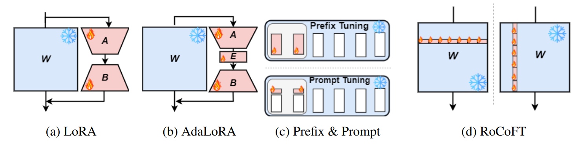

# RoCoFT

This is the implementation for the paper "RoCoFT: Efficient Finetuning of Large Language Models with Row-Column Updates".


<div align="center">


</div>

<div align="center">

**[<a href="https://arxiv.org/">Paper</a>]**
**[<a href="https://github.com/Kowsher/RoCoFT">Code</a>]**


</div>


<p align="center">



</p>

---
>
> 🙋 Please let us know if you find out a mistake or have any suggestions!
> 
> 🌟 If you find this resource helpful, please consider to star this repository and cite our research:

```
@inproceedings{kowsher2024rocoft,
  title={RoCoFT: Efficient Finetuning of Large Language Models with Row-Column Updates},
  author={Kowsher, Md and Esmaeilbeig, Tara and Yu, Chun-Nam and Soltanalian, Mojtaba and Yousefi, Niloofar},
  
}
```

## Introduction
 RoCoFT is a  parameter-efficient fine-tuning (PEFT) method designed to optimize task-specific performance while drastically reducing computational overhead by training selective rows and columns from pre-trained weight matrix

<p align="center">


</p>


## Requirements
Use python 3.11 from MiniConda

- torch==2.3.0
- accelerate==0.33.0
- einops==0.7.0
- matplotlib==3.7.0
- numpy==1.23.5
- pandas==1.5.3
- scikit_learn==1.2.2
- scipy==1.12.0
- tqdm==4.65.0
- peft==0.12.0
- transformers==4.44.0
- deepspeed==0.15.1
- sentencepiece==0.2.0


To install all dependencies:
```
pip install -r requirements.txt
```

## Datasets
You can access the datasets from hugginface

## Quick Demos

To get started with `RoCoFT`, follow these simple steps:

1. **Import the necessary modules:**

    ```python
    import RoCoFT
    from transformers import RobertaForSequenceClassification
    ```

2. **Load a pre-trained model and apply PEFT:**

    ```python
    model = RobertaForSequenceClassification.from_pretrained('model_name')
    RoCoFT.PEFT(model, method='row', rank=1) 
    ```

3. **For column**

    ```python
    leader.PEFT(model, method='column', rank=1) 
    ```
4. **In order to choose row or column using pruning technique**

    ```python
    import RoCoFT
    
    # Example text input
    input_text = tokenized_datasets['train']['sentence'][0:200]
    
    input_text = []
    for i in tqdm(range(len(tokenized_datasets['train']['premise'][0:200]))):
        st = tokenized_datasets['train']['premise'][i] + tokenized_datasets['train']['hypothesis'][i]
        input_text.append(st)
       
    input_ids = tokenizer(input_text, return_tensors='pt', padding=True, truncation=True)['input_ids']
    
    
    # Get the embedding of the input text
    with torch.no_grad():
        embeddings = model.roberta.embeddings(input_ids)

    RoCoFT.PEFT_prunig(model, method='column', rank=3, input_data=embeddings, descending=False)
    ```

    
If `descending=True`, pruning method return the least weights. 

🚩 **Note:** In the examples or notebook, we have used `leader` ,  feel free to replace it with  `RoCoFT`
